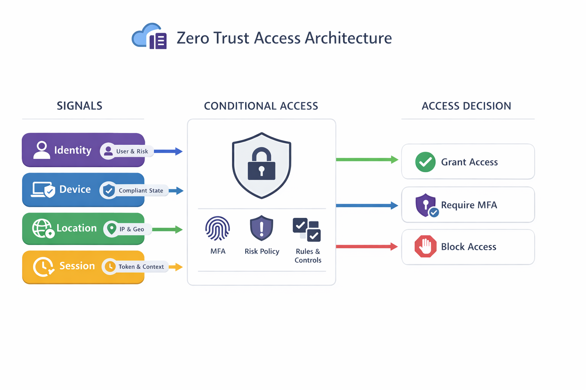

<h1>🔐 Microsoft Entra Zero Trust Conditional Access Playbook</h1>

[](https://learn.microsoft.com/en-us/entra/)
[](https://learn.microsoft.com/en-us/security/zero-trust/)
[](https://github.com/dferrell30/Zero-Trust-Conditional-Access-Playbook)
[](scripts/)
[](https://github.com/dferrell30/entra-phish-resistant-mfa)
[](LICENSE)

---

## 📌 Overview

This repository provides a **complete, production-ready implementation** of **Zero Trust Conditional Access policies** using Microsoft Entra ID.

It is designed as a **step-by-step playbook** that includes:

- 🔐 Policy design aligned to Zero Trust
- ⚙️ PowerShell-based deployment (Microsoft Graph)
- 🧱 Separation of Entra ID **P1 vs P2 capabilities**
- 📤 Export, backup, and reporting scripts
- 🧪 Testing and validation guidance

---

## 📌 Project Status

This project is actively maintained and refined based on testing, implementation experience, and community feedback.

Current focus areas:

- Conditional Access policy design improvements
- Safer rollout guidance
- Export / backup / reporting enhancements
- Expanded Zero Trust implementation coverage

---

## 👥 Who This Is For

This playbook is designed for:

- Microsoft Entra administrators
- Identity and access engineers
- Security architects
- Microsoft 365 / Zero Trust practitioners
- Teams building a production-ready Conditional Access baseline

This repository is especially useful for organizations that want to move from basic MFA enforcement to a layered Zero Trust access model using identity, device, location, and session signals.

---

## 🔐 Zero Trust Architecture



This architecture uses Microsoft Entra ID as the identity control plane.

Access is evaluated using multiple signals:

- Identity (user, role, risk)
- Device (compliance, join state)
- Location (trusted vs untrusted)
- Session (token lifetime, persistence)

All access decisions are enforced through Conditional Access policies.

---

## 🔄 Deployment Flow


This flow represents how Conditional Access evaluates every sign-in attempt:

1. User initiates authentication
2. Microsoft Entra evaluates signals:
   - Identity risk
   - Device compliance
   - Location
   - Session context
3. Conditional Access policies are applied
4. Access is:
   - Granted
   - Challenged (MFA)
   - Blocked

This ensures every access request is continuously validated under Zero Trust principles.

---

## 🎯 Attack Path → Policy Mapping

| Attack Technique | Example | Policy That Stops It |
|----------------|--------|---------------------|
| Password Spray | массовые login attempts | Require MFA |
| Legacy Auth Abuse | IMAP/POP brute force | Block Legacy Auth |
| Stolen Credentials | Phishing | MFA + User Risk |
| Token Theft | Session replay | Session Controls |
| Unmanaged Device Access | Personal laptop | Device Compliance |
| Admin Account Takeover | Privilege escalation | Admin Protection |
| Suspicious Login | Impossible travel | Sign-in Risk Policy |
| Compromised Account | Leaked credentials | User Risk Policy |

This ensures **defense in depth across identity, device, and session layers**.

## 🎯 Objectives

* Enforce **strong authentication everywhere**
* Eliminate **legacy authentication attack paths**
* Protect **privileged identities**
* Require **trusted devices**
* Detect and respond to **identity risk (P2)**

## 🔐 Phishing-Resistant MFA (Recommended Enhancement)

To further strengthen identity security, implement phishing-resistant authentication methods:

### Supported Methods

- FIDO2 Security Keys
- Windows Hello for Business (WHfB)
- Certificate-Based Authentication (CBA)

### Benefits

- Resistant to phishing attacks
- Eliminates OTP fatigue attacks
- Strong device-bound authentication

### Integration with This Repo

These methods can be enforced using:

- Authentication Strength policies
- Conditional Access grant controls

### Future Enhancement

This repository can be extended to include:

- Authentication Strength enforcement
- Phishing-resistant MFA rollout guide


---

## 🧭 Table of Contents

* [Architecture](docs/architecture.md)
* [Zero Trust Principles](docs/zero-trust-principles.md)
* [Licensing (P1 vs P2)](docs/licensing-p1-vs-p2.md)
* [Deployment Guide](docs/deployment-guide.md)
* [Exports & Backup](docs/exports-and-backup.md)

---

## 🧱 Repository Structure

```text
policies/       → Individual Conditional Access policies (self-contained)
scripts/        → Deployment, export, and helper scripts
docs/           → Architecture and guidance
exports/        → Generated JSON + reports
templates/      → Reusable templates
images/         → Diagrams and visuals
```

---

## 🔐 Conditional Access Policy Set

### Entra ID P1 — Core Zero Trust Policies

| Policy | Purpose |
|---|---|
| 01 Require MFA | Enforce strong authentication |
| 02 Block Legacy Auth | Remove insecure authentication paths |
| 03 Require Compliant Device | Ensure trusted endpoints |
| 04 Admin Protection | Secure privileged identities |
| 05 Session Controls | Limit token/session risk |
| 06 Location-Based Access | Context-aware authentication |

### Entra ID P2 — Identity Protection Policies

| Policy | Purpose |
|---|---|
| 07 User Risk Policy | Respond to compromised accounts |
| 08 Sign-in Risk Policy | Block or challenge risky logins |

---

### 🔵 Entra ID P2 — Identity Protection Policies

| #  | Policy              | Purpose                         |
| -- | ------------------- | ------------------------------- |
| 07 | User Risk Policy    | Respond to compromised accounts |
| 08 | Sign-in Risk Policy | Block or challenge risky logins |

---

## 🧭 Zero Trust Coverage

| Threat | Protection |
|---|---|
| Password spray | MFA policy |
| Legacy protocol attacks | Block legacy authentication |
| Device compromise | Device compliance policy |
| Admin takeover | Admin protection policy |
| Token theft | Session controls |
| External attacks | Location-based controls |
| Account compromise | User risk policy (P2) |
| Suspicious logins | Sign-in risk policy (P2) |

---

## 🚦 Recommended Rollout Strategy

Do not deploy Conditional Access broadly without staged validation.

Recommended order:

1. Review policy design and prerequisites
2. Identify and validate break-glass / emergency access accounts
3. Deploy policies in report-only mode where possible
4. Start with a pilot group
5. Validate sign-in behavior and policy results
6. Expand to privileged users
7. Expand to broader production groups
8. Enforce policies only after successful validation

A phased rollout helps prevent lockouts, unexpected access failures, and misconfiguration in production.

---

## ⚠️ Lockout Prevention / Safety Checks

Before deploying or enforcing Conditional Access policies, confirm the following:

- At least one break-glass account exists and is excluded from Conditional Access
- Admin accounts have tested MFA methods registered
- Device compliance requirements are understood before enforcement
- Legacy authentication dependencies have been identified
- Named locations are validated before location-based policies are enforced
- Pilot users have been selected and tested
- Sign-in logs are being reviewed during rollout

Do not enforce broadly until these checks are complete.

---

## ⚙️ Deployment

### 1️⃣ Install prerequisites

```powershell
cd scripts/deployment
.\install-prereqs.ps1
```

---

### 2️⃣ Deploy a single policy

```powershell
cd policies/01-require-mfa
.\deploy.ps1
```

---

### 3️⃣ Deploy all policies

```powershell
cd scripts/deployment
.\deploy-policies-bulk.ps1
```

---

### 4️⃣ Create named location

```powershell
cd scripts/named-locations
.\create-named-location.ps1
```

---

## 📤 Export & Backup

Export your current environment:

```powershell
cd scripts/export
.\export-ca-config.ps1
```

Generate:

* Raw JSON (tenant snapshot)
* Import-ready JSON
* Markdown inventory report

---

## 🧪 Validation & Testing

After deployment, validate that policies behave as expected.

### What to Validate

- MFA is required where expected
- Legacy authentication is blocked
- Unmanaged devices are denied or challenged appropriately
- Privileged users receive stronger controls
- Session controls are applied where intended
- Location-based policies evaluate correctly
- User Risk and Sign-in Risk policies trigger correctly if P2 is available

### Where to Validate

- Microsoft Entra sign-in logs
- Conditional Access policy evaluation results
- Test accounts in pilot groups
- Admin / privileged user sign-in scenarios
- Managed vs unmanaged device scenarios
- Trusted vs untrusted location scenarios

### Success Criteria

- No unexpected admin lockouts
- Policy outcomes match intended design
- Pilot users can still complete required work
- Report-only results align with expected behavior before enforcement

Use:

* Microsoft Entra **Sign-in logs**
* Conditional Access evaluation tab
* Identity Protection dashboards (P2)

---

## ⚠️ Deployment Best Practices

* Always start in **Report-only mode**
* Exclude **break-glass accounts**
* Deploy to **pilot groups first**
* Validate with **sign-in logs**
* Communicate changes to users

---

## ⚠️ Common Mistakes

The following issues commonly cause problems in Conditional Access deployments:

- Enforcing policies before validating break-glass access
- Blocking legacy authentication without understanding dependencies
- Requiring compliant devices before device management is fully ready
- Applying broad policies to all users too early
- Misconfiguring named locations
- Assuming MFA alone is sufficient for Zero Trust
- Forgetting to review report-only results before enforcement
- Treating session controls as a substitute for strong authentication

---


## 🧠 Design Principles

This playbook follows Zero Trust:

* **Verify explicitly** (MFA, risk signals)
* **Use least privilege** (admin protection)
* **Assume breach** (session + risk policies)

---

## 🚀 Recommended Rollout Order

### See README in Scripts folder for full details on how to prepare and run the scripts to deploy once you clone the repo.

1. Require MFA
2. Block legacy authentication
3. Device compliance
4. Admin protection
5. Session controls
6. Location-based access
7. User risk policy (P2)
8. Sign-in risk policy (P2)

---

## 🔮 Future Enhancements

* Authentication Strength policies
* Phishing-resistant MFA (FIDO2, WHfB)
* Token protection
* Continuous Access Evaluation (CAE)
* Workload identity protection

---

## 📄 License

This project is licensed under the MIT License.

---

## 🤝 Contributing

Contributions, improvements, and enhancements are welcome.

---

## ⭐ Summary

This repository provides a **complete Zero Trust Conditional Access framework** that is:

* Modular
* Script-driven
* Scalable
* Enterprise-ready

## 🧠 Zero Trust Maturity Model


This implementation aligns to a Zero Trust maturity model:

### Level 1 — Basic Protection
- MFA enforcement
- Block legacy authentication

### Level 2 — Device Trust
- Require compliant or hybrid joined devices
- Admin protection policies

### Level 3 — Session & Context
- Session controls
- Location-based access

### Level 4 — Identity Protection (P2)
- User risk policy
- Sign-in risk policy

This repository delivers a full progression from baseline security to advanced Zero Trust enforcement.

---

## 🧠 Key Takeaway

Conditional Access is most effective when it is treated as a layered control system rather than a single MFA requirement.

Strong Zero Trust access design depends on:

- Identity-aware enforcement
- Device trust
- Location context
- Session control
- Safe rollout and validation

---

## ⚠️ Disclaimer

This data and scripts are provided for **educational, testing, and security validation purposes only**.

Use of this tool should be limited to:
- Authorized environments  
- Lab or approved enterprise systems  

The author assumes **no liability or responsibility** for:
- Misuse of this tool  
- Damage to systems  
- Unauthorized or improper use  

By using this data and scripts, you agree to use it in a lawful and responsible manner.
---

This project is not affiliated with or endorsed by Microsoft.
---


## ⚖️ Professional Disclaimer

This project is an independent work developed in a personal capacity.

The views, opinions, code, and content expressed in this repository are solely my own and do not reflect the views, policies, or positions of any current or future employer, client, or affiliated organization.

No employer, past, present, or future, has reviewed, approved, endorsed, or is in any way associated with these works.

This project was developed outside the scope of any employment and without the use of proprietary, confidential, or restricted resources.

All code/language in this repository is provided under the terms of the included MIT License.
